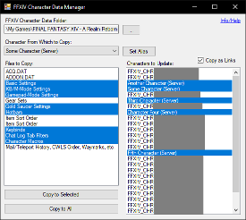

# CharacterDataManager

## Purpose
This is a tool for Final Fantasy XIV that allows more control over syncing character data (settings, hotbars, keybinds, etc.).  While I've tried to make everything function correctly (I wrote this for myself to use, after all), use of this program is at your own risk (please read the [IMPORTANT](#important) section below).

## Basic Use
1. Either grab the latest [release](../../../releases) or build the program from source.
1. When you run the program for the first time, you will be reminded to back up your character settings before continuing.
1. Select the folder in which FFXIV stores user configuration files.  The program assumes "...\Documents\My Games\FINAL FANTASY XIV - A Realm Reborn" for the current user when it first starts up, but this can be changed by clicking the "..." button if it is incorrect (or if you have another folder that you would like to use (i.e., a copy made for testing)).
1. Select the character that you would like to use as the source/master character.  See the [Aliases](#aliases) section below for more information on character names.
1. Select the settings files that you would like to copy between characters.  Use Ctrl and/or Shift to select multiple files at once.
1. Select the characters to which you would like to copy settings.  Again, use Ctrl and/or Shift to select multiple characters.
1. Ensure that you are logged out of the source and target character(s) before proceeding.
1. Press the "Copy to Selected" button to copy the desired files to the selected characters.  Alternatively, press "Copy to All" to copy the desired files to all available characters.
1. See the [Using Links](#using-links) section below for an optional way to keep data in-sync without copying files every time.

## Using Links
This program supports copying character configuration files as hard links, essentially allowing for multiple character's configuration to be stored in the same file.  This means that changes made to the file from one character can be reflected in another without actually copying the file after the change was made.  To do this, prepare a basic settings file copy as described above, but before clicking the button to copy, check the "Copy as Links" checkbox.

It is important to note a few things before using this feature:
* This feature is only available on drives formatted as NTFS.  This is a Windows and filesystem limitation.
* Windows handling of links can be a bit finicky.  Copying or moving files in certain ways can de-link them, and copying a file over a linked file will generally fail.  Because of this the program deletes existing files in the target directory before linking them.
* If the game ever changes how it handles writing data to the settings files, it may break the links at each write, at which point this feature would no longer work.

## IMPORTANT
This program should be considered as being in beta.  It directly overwrites some or all your local character configuration files, and if there are any unknown bugs, it could render them unusable and require you to restore from backup.  It is also technically possible for SE to detect the use of this program, but only in the sense that they would be able to detect that you had manually copied or linked the files yourself (i.e., copying via the file explorer or the command line).

## Aliases
By default, character names will be an unfriendly string of numbers and letters, such as "FFIXV_CHR...".  Clicking "Set Alias" and entering something that you will easily remember (i.e. "Character Name (Server)" will make a friendly name appear in the list for that character instead.  Unfortunately, you will have to determine which folder corresponds to which character manually.  There are two ways that I know of to do this:
* The most basic way to determine which folder belongs to a character is to log in to that character, change your item order in your inventory, change a user macro, a hotbar, etc., log back out, and then find which folder contains a file modified at the time you logged out.
* With the [Quick Launcher](https://github.com/goatcorp/FFXIVQuickLauncher) (unofficial), by installing the Character Sync plugin and checking the config page for it while logged in.  If you're going to use that plugin, though, this program is largely worthless.

## License
Code and executable are covered under the [MIT License](LICENSE).  Final Fantasy XIV (and any associated data used by this program) is copyright and owned by Square Enix.
